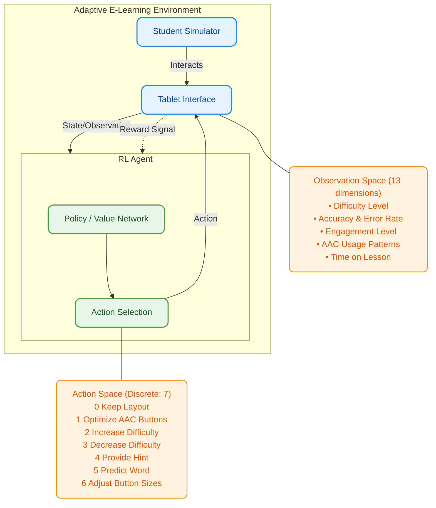

# Adaptive E-Learning & AAC Platform

**Mission-Based Reinforcement Learning Summative Assignment**

## Project Overview

**Brainiac** is a simulated adaptive e-learning platform designed to assist children with physical disabilities (e.g., Cerebral Palsy, Muscular Dystrophy). The core mission is to train a Reinforcement Learning (RL) agent to act as an intelligent interface manager that dynamically adapts the learning experience to the student's needs.

The agent learns to:
1.  **Adjust Lesson Difficulty**: Keep the student in the "flow channel" (optimal challenge).
2.  **Optimize Interface**: Rearrange AAC (Augmentative and Alternative Communication) buttons for easier access based on motor control profiles.
3.  **Provide Assistance**: Offer hints or predict words to reduce frustration.

## Agent-Environment Diagram

The following diagram illustrates the interaction between the RL Agent and the Adaptive E-Learning Environment, as required by the assignment rubric.



## Project Structure

```
project_root/
├── environment/
│   ├── custom_env.py       
│   └── rendering.py        
├── training/
│   ├── dqn_training.py     
│   ├── reinforce_training.py 
│   ├── ppo_training.py     
│   └── a2c_training.py     
├── models/                 
├── results/                
├── main.py                 
└── requirements.txt       
```

## Installation

1.  **Clone the repository**
2.  **Create a virtual environment**:
    ```bash
    python -m venv venv
    source venv/bin/activate  # On Windows: venv\Scripts\activate
    ```
3.  **Install dependencies**:
    ```bash
    pip install -r requirements.txt
    ```

## Usage

### 1. Training Agents
You can train the agents using the scripts in the `training/` directory. Each script performs hyperparameter tuning and saves the best model.

```bash
# Train DQN
python training/dqn_training.py

# Train REINFORCE
python training/reinforce_training.py

# Train PPO
python training/ppo_training.py

# Train A2C
python training/a2c_training.py
```

### 2. Running the Simulation
Use `main.py` to run the trained agents or a random baseline with the PyGame visualization.

```bash
# Run the best trained PPO agent
python main.py --algorithm ppo

# Run a specific model file
python main.py --algorithm dqn --model-path models/dqn/dqn_best.zip

# Run a random agent (baseline)
python main.py --random

# Test the environment visualization only
python main.py --test-env
```

## Hyperparameter Tuning
The training scripts automatically iterate through multiple hyperparameter configurations (learning rate, gamma, batch size, etc.) to find the optimal policy. Results are saved to CSV files in the `results/` directory.
